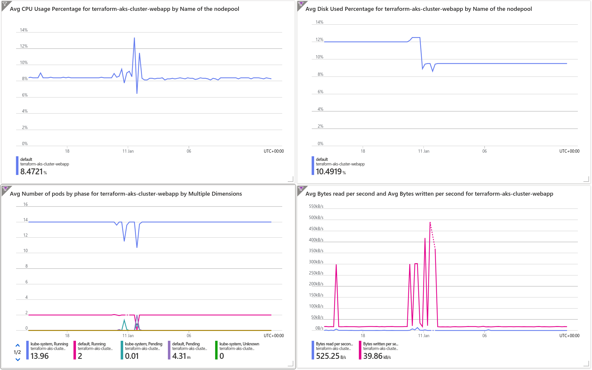
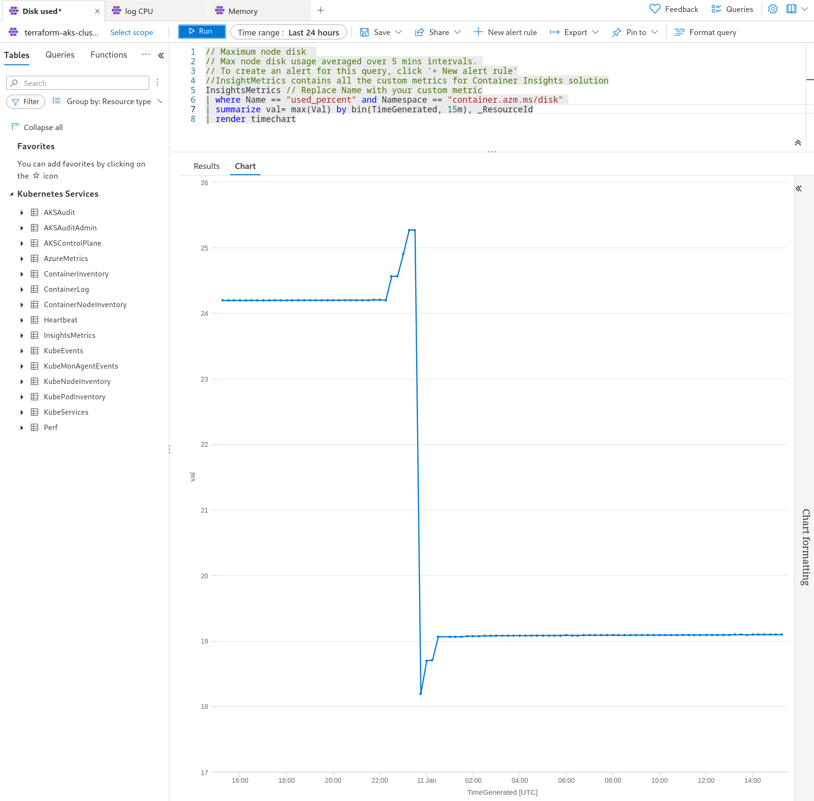
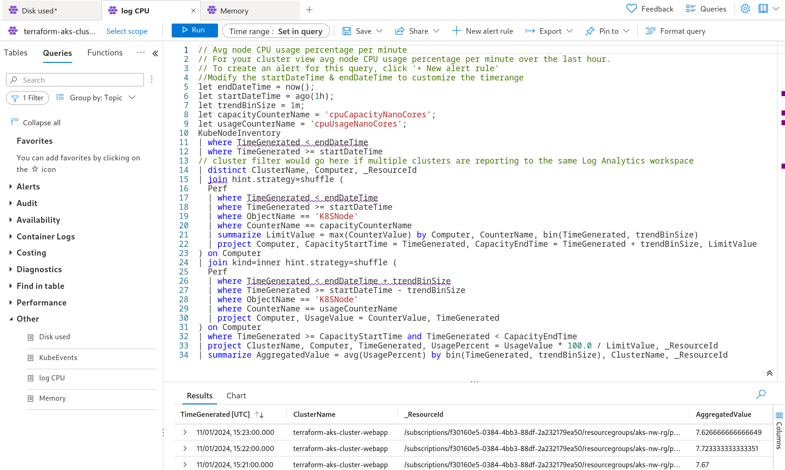
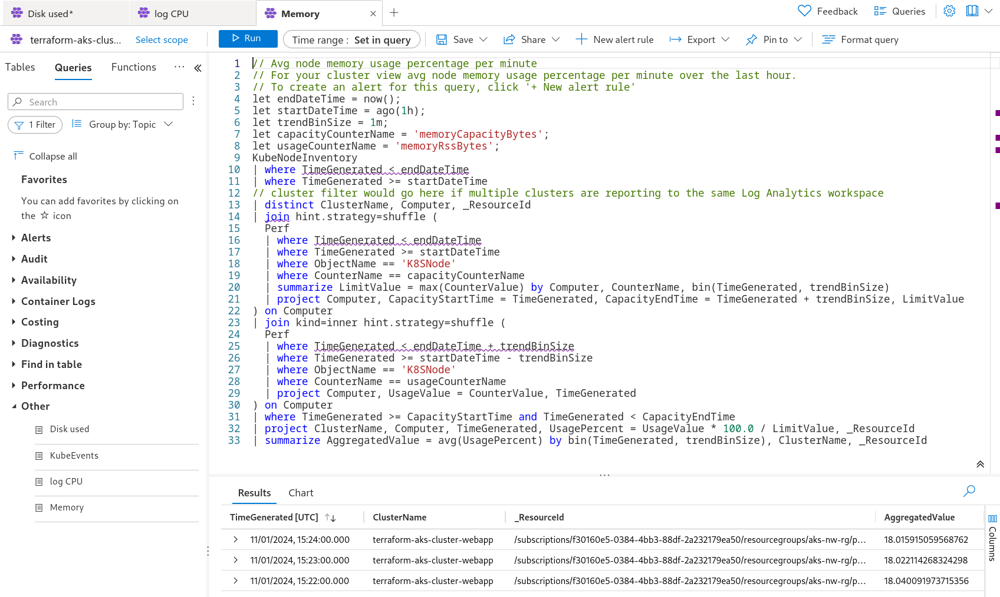
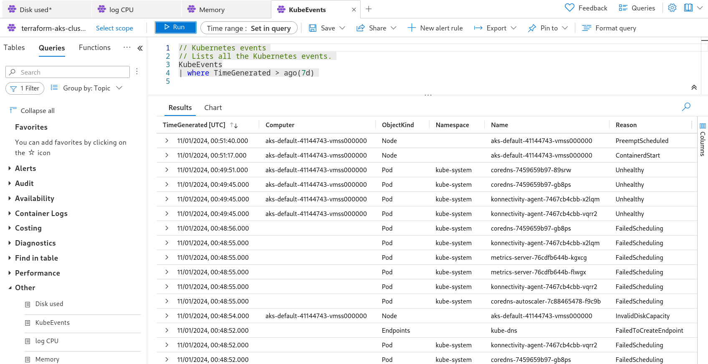
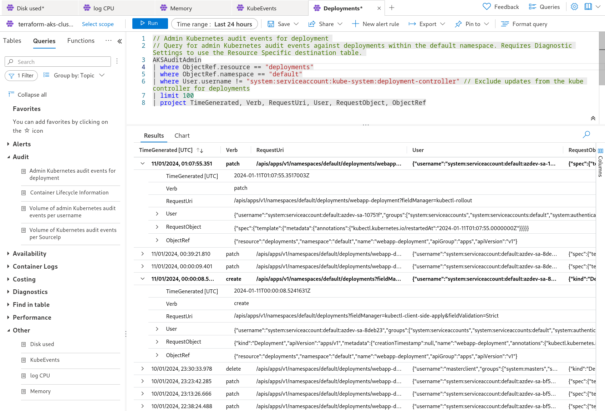
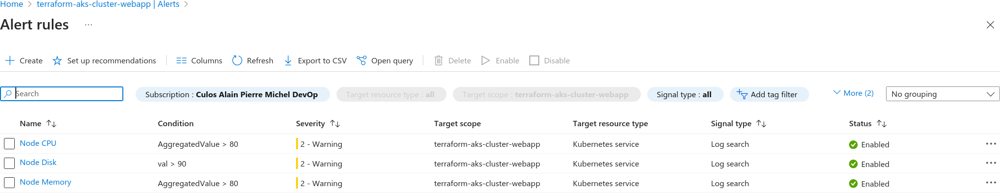
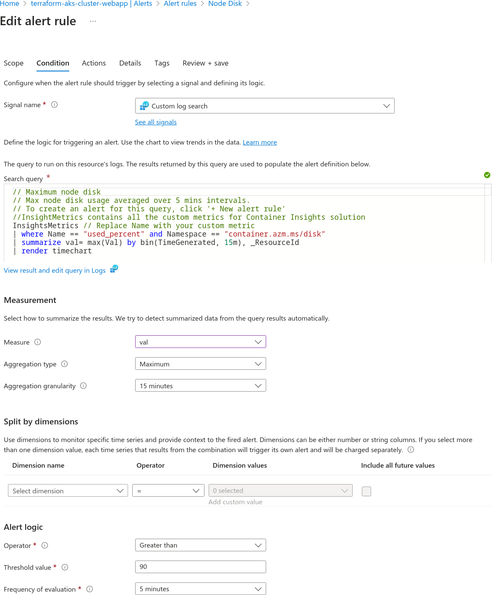

# [CI/CD](../README.md#cicd)

- [IaC, Infrastructure as Code](CourseNotes-IaC.md)
- [WebApp: deployment, access, test and validation](CourseNotes-WebApp.md)
- [Azure Pipeline build and deployment](CourseNotes-Pipeline.md)
- [Cluster monitoring](CourseNotes-Monitoring.md)
- [Key Vault integration](CourseNotes-KeyVault.md)

# Cluster monitoring

Pre-requisite: For AKS container insights and diagnostics to fully work, I had to assign the Log Analytics Contributor role to the SP (Service Principal) used to create the AKS cluster - and re-create the cluster.

## Metrics

Some basic and essential metrics to monitor are:
- average node CPU usage:   
  If maximum capacity is reached, it means that the demand exceeds the system's capacity to respond. At best this may impact the user by visibly being slow to respond. At worst this may cause the application to crash.
- average node memory usage (not shown on diagram below):   
  If maximum capacity is reached, it may cause the application to stop working. At best it may cause a pod to restart, temporarily freeing up capacity, at worst, the application will stop working altogether.
- maximum node disk usage:   
  Same as with memory, if maximum capacity is reached, it may cause the application to stop working. At best it may cause a pod to restart, temporarily freeing up capacity, at worst, the application will stop working altogether.
- disk I/O read/writes:
  High disk I/O read or writes can be a performance bottleneck, causing the user to experience slow response times.
- count of pods by phase and namespace:   
  This allows to monitor the progress of deployments.

## Logs

The logs section enables more in depth analysis of metrics and logs, and enables to set alerts to help with proactively managing the operation of the cluster. Example indicators are:
- average node CPU usage
- average node memory usage
- maximum node disk usage
- warning messages in container logs
- Kubernetes events
- deployment events
- ...

## Alerts

Alerts enable us to proactively manage the operation of the cluster. Examples are:
1. Send an email warning the system reached 90% storage capacity
1. Send an email warning the system reached 80% average CPU usage over the last 15 minutes
1. Send an email warning the system reached 80% average memory usage over the last 15 minutes

## Response to operational events

The response to an operational event or situation will vastly depend on the severity, frequency and impact of the situation. For minor events, one might just file a problem report for later analysis, for major events with critical impact on the viability of the business, a very quick response would be warranted.

But no matter what, the steps to solving a problem may be as follows:
- record the incident - taking care to document everything that would be helpful to its analysis.
- assess the situation: is there a need or possibility to react fast without major risks to further degrade the situation?
- if needed, design and implement a rapid short term solution. An example of this, in cases such as reaching resource capacity (memory, CPU, disk space, performance bottleneck), might simply be to scale up the cluster - add more nodes to increase node capacity and spread the load (node stats struggling), add more pods if the problem is caused by increased demand (pod stats struggling).
- but generally short term solutions may not be cost effective in the long run (either in resource usage or impact on project milestones or product maintainability), so a more thought through approach might be warranted: a planned corrective action, similar to a new feature, would have to go through a more standard project cycle. For example reaching disk capacity might be due to a verbose log setting that is not really required, or maybe there is a requirement to purge unnecessarily old logs, in which case scaling is a very inefficient approach, though it might be necessary until a permanent fix is issued.

There may be a benefit to proactively identify and draw up procedures for dealing with the most basic potential issues, but generally, most procedures would be drawn and refined following actual incidents - though possibly, and preferably, before the product is in production.